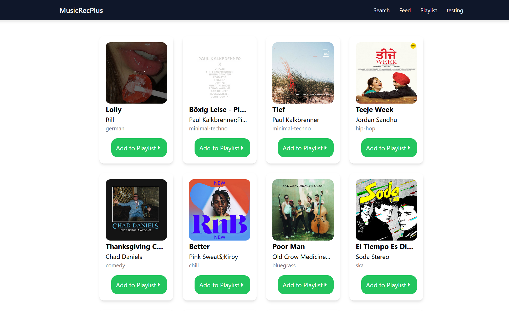
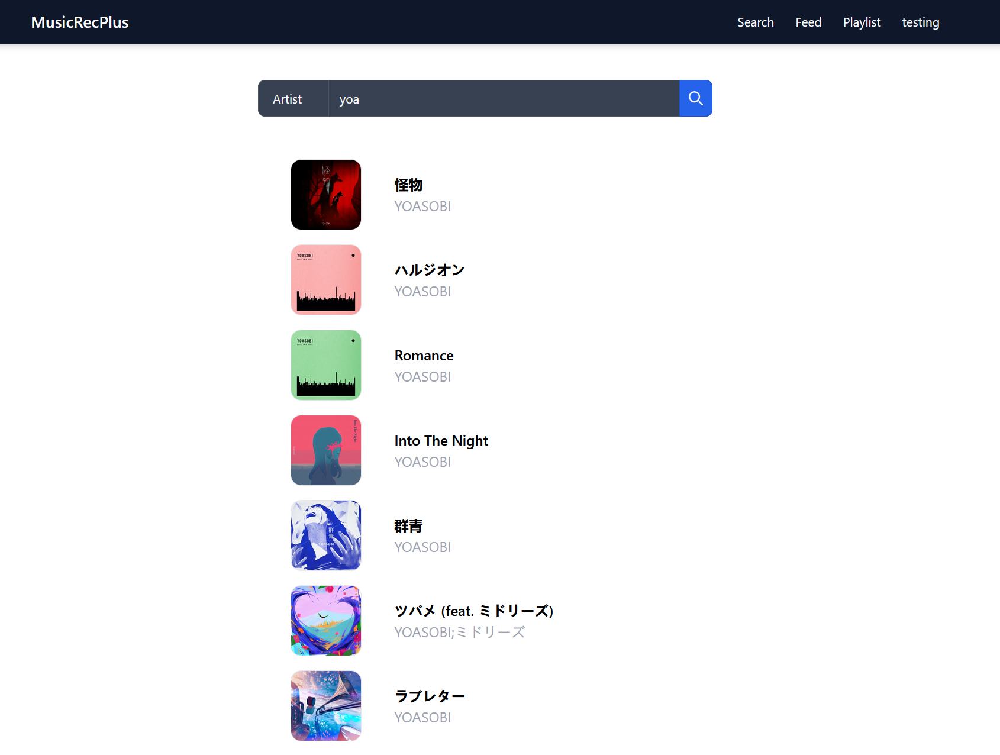
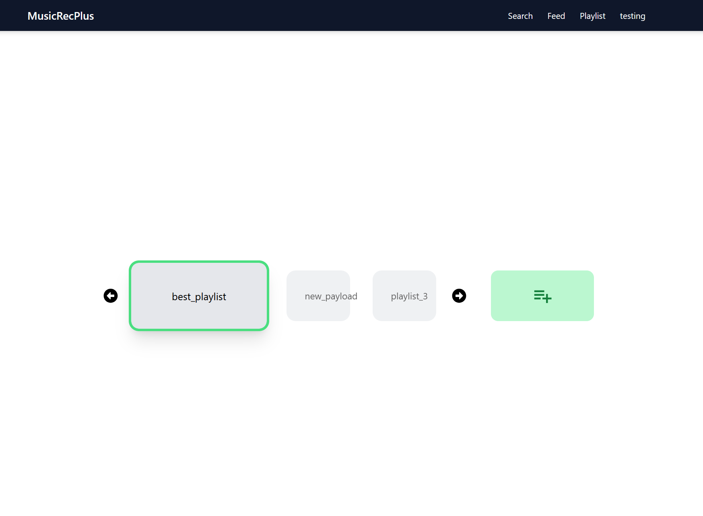
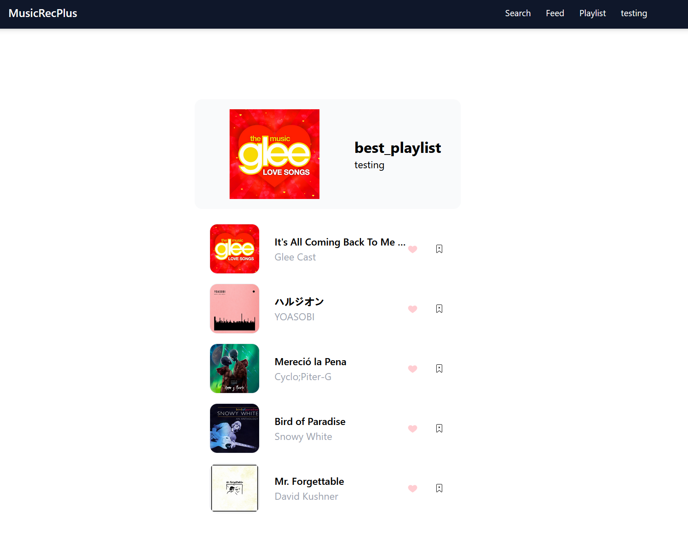

# MREK - Music Recommendation
Music Recommendation System based on favorite songs and the managed playlist.

## Screenshots





## Setup
1. git clone ```https://github.com/chengq220/MusicRecFront.git```
2. Run ```docker-compose up --build``` to build the docker image
3. The default port is localhost:3000

## Backend
The backend code can be found at ```https://github.com/chengq220/MusicRecBack```
